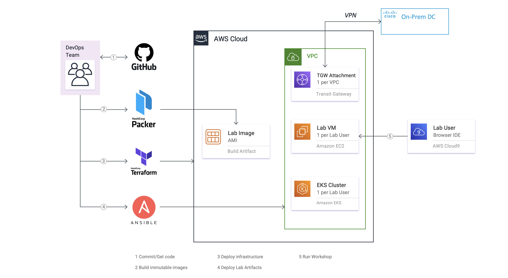

# AppD-FSO-Lab-AWS-EKS

This code repository is a DevOps project that is a subset of the [FSO Lab DevOps](https://github.com/APO-SRE/fso-lab-devops) 
project. Its specific purpose is to help automate the deployment of AWS resources via Terraform for 
the Cisco Full Stack Observability (FSO) series of workshops for AppDynamics partners and customers.  

Although these Terraform code templates could be used in a stand-alone fashion, they are actually tightly 
integrated with the Cisco SRE [Terraform Cloud Workspaces](https://www.terraform.io/cloud-docs/workspaces) 
in order to trigger deployment of the AWS workshop resources. As changes are committed to this repository, 
Terraform Cloud automatically initiates a new Plan action.

## AWS Architecture

Here is an example of the deployment architecture when deployed to the AWS Cloud Platform:  

__FSO Lab DevOps: Workshop Deployment on AWS__

